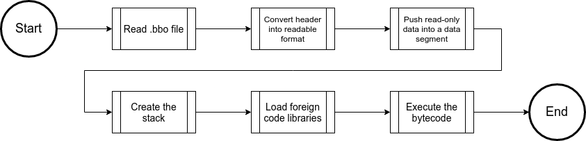

# BreezeVM Portfolio
GitHub repo can be found [here](https://github.com/F0x1fy/BreezeVM).

## What is BreezeVM?
The Breeze Virtual Machine (BreezeVM or BVM) is a process virtual machine for a custom bytecode and instruction set (BVMAsm), similar to the Java Virtual Machine (JVM). BreezeVM's bytecode (Breeze Bytecode, or BBC) is type-agnostic to natively support dynamically-typed languages.

Due to a compiler bug in Odin that invalidated the previous project, this project was quickly designed and developed in a month to meet the capstone's due date. Due to this, tests are severely lacking, as well as the implemented instructions.

To view BreezeVM's design and skip the user guide, please click on this link to go to [BreezeVM's Design](#breezevms-design).

## BreezeVM User and System Administrator Guide
This user guide covers how to download, build, and use each part of BreezeVM. If any issues are encountered building the program, feel free to email [alecsanchez@avian-lang.org](mailto:alecsanchez@avian-lang.org).

### How to Download BreezeVM
There are two ways to download BreezeVM: through `git` and through a `.zip` file.

#### Through Git
To download BreezeVM through `git`, make sure to have [git](https://git-scm.com/) installed, then head to a directory where to clone BreezeVM (can be anywhere), then simply type "`git clone https://github.com/F0x1fy/BreezeVM.git`". This will then download the repository in a "`BreezeVM`" subdirectory.

#### Through a ZIP File
Please click [here](https://github.com/F0x1fy/BreezeVM/archive/refs/heads/master.zip) to download the `ZIP` file.

### How to Build BreezeVM
Building BreezeVM requires a program that can operate on `Makefile`s, as well as the [Odin](http://odin-lang.org/) compiler. The recommended program is [make](https://www.gnu.org/software/make/) on Linux. Note that these make commands require Linux, though the commands within them (with the exclusion of "`find`") can be ran manually on Windows, given that the [Odin](http://odin-lang.org/) compiler is installed.

There is a `Makefile` in the root directory of the project. All `make` commands must be ran in the root of the repository.

* To update the repo, simply type "`make update-breeze`", which is just "`git pull`" under the hood. This requires [git](https://git-scm.com/).

```
> make update-breeze
git pull
Already up to date.
```

* To update the `lib` (currently unused, but may be used in the future), run "`make update-lib`".

```
> make update-lib
find bin/* -not -name '.gitkeep' -delete
Binary directory has been cleaned.
```

* To build the assembler, run "`make assembler`". The assembler will then be created in the `bin` directory.

```
> make assembler
odin build Source/Assembler -out=bin/bvmasm -collection:breeze=Source/BreezeVM -collection:assembler=Source/Assembler
```

Then, a `bvmasm` binary file will be created in the `bin` directory.

* To build the VM, run "`make vm`". The VM will then be created in the `bin` directory.<br />Output should look like:

```
> make vm
odin build Source/BreezeVM -out=bin/bvm -collection:breeze=Source/BreezeVM -collection:assembler=Source/Assembler
```

Then, a `bvm` binary file will be created in the `bin` directory.

* To clean up the binary directory, run "`make clean`".<br />Output should look like:
```
> make clean
find bin/* -not -name '.gitkeep' -delete
Binary directory has been cleaned.
```

Then, the `bin` directory will be emptied except for the `.gitignore` file.

### How to Use BVMAsm
In order to assemble a [BVMAsm](#what-is-breezevm) file, first create a file titled "`[name].bvmasm`" (where "`[name]`" can be any name wanted) with valid BVMAsm in it, then call the assembler (`bvmasm`) on the file(s). A `program.bbc` file will be created if there are no errors. Any errors will be printed out before the program halts.

Example of use:
```
> bvmasm hello-world.bvmasm
Completed binary in 0.232ms.
```
(Time may differ based on outside factors)

Then, running "`ls`" reveals that a `program.bbc` file has been created, which can later be used by `bvm` for interpretation:
```
> ls
hello-world.bvmasm  program.bbc
```

### How to Use BVM
In order to interpret a [.bbc](#what-is-breezevm) file, call the VM (`bvm`) on the file. From there, the VM will attempt to load then de-serialize the file passed. If it does not find the file, or the serialization is invalid, the VM will halt and error out. If there are any errors during interpretation, the VM will error out and halt.

Example of use:
```
> bvm program.bbc
Hello, World!
```

### BVM For Administrators
BVM currently requires no configuration, and will be standard across all builds. There is no hosting or anything similar required to use BreezeVM. `bvmasm` and `bvm` must simply be installed on any computer that needs to use it using the instructions given in [How to Build BreezeVM](#how-to-build-breezevm). BVM, unless intrinsic procedures are added and used that can access outside resources such as the file system and the internet, is entirely isolated and does not pose any inherit security risks that have to be accounted for.

## BreezeVM's Design
Breeze is broken up into two portions, the assembler (bvmasm) and the VM (bvm). The assembler handles turning `.bvmasm` files into `.bbc` files, then the VM reads said `.bbc` files and operates on them. Disregarding endianness, `.bbc` files are entirely platform-independent. A `.bbc` file could be compiled on Windows and run just the same on Mac, Linux/GNU, or any other operating system.

The design can be shown at a high level as:


### VM Overall Design


### Stack
The VM currently has a hard-coded stack size of 2KB (42 values). In a full release, this would be definable, or definable in the program itself.

### Data Values
The VM can contain any number of constant, read-only data. These are accessible through data offsets using the `CONST`-related instructions.

### Prepared Values
Instead of a set number of registers, BVM uses "prepared" values. The {`PREPARE`} instructions allow the program to push to the prepared values. Prepared values are used to pass values to some instructions and to procedures.

### Intrinsic Procedures
Intrinsic procedures are defined in the virtual machine and are accessible in BVMAsm through the {`CALL`} instruction, followed by the procedure used in the jump table. Currently, there is only one intrinsic procedure, which prints out prepared values to `stdout` and is used for both the Fibonacci test as well as the Hello World test.

### Scopes
Scopes are self-isolated chunks of code. The only way scopes interact is through pulling arguments from the parent scope. A child scope cannot access the stack of a parent scope.

### Blocks
Blocks are sub-sections of code within scopes. They can use the stack values of its parent scope and blocks. A block stores prepared values, so a block must be defined within a scope in order to use prepared values. Blocks also make managing prepared values within self-contained sections of code in a stack incredibly easy, removing the need to pull prepared values often.

## Breeze Bytecode Files
Breeze Bytecode files (`.bbc` files) have a custom format to make serializing and deserializing simple and efficient. These files are broken into two parts: The header section, and the bytecode section.

### BBC Header
A Breeze Bytecode header is broken up into several parts, some of variable length, and some of fixed length.

* 64 bits => Length of the entire header in bytes.

* 64 bits => Amount of procedure descriptors.

* 64 bits => Length of the procedure descriptors in bytes.

* N bits => An array of procedure descriptors. Code [here](https://github.com/F0x1fy/BreezeVM/blob/master/Source/BreezeVM/Types/interpreter.odin#L14). Name must be followed by a null terminator.

* 64 bits => Amount of foreign imports.

* 64 bits => Length of the foreign imports in bytes.

* N bits => An array of foreign import names. The names are null-terminated strings.

* 64 bits => Amount of data descriptors.

* 64 bits => Length of the data descriptors in bytes.

* N bits => An array of data descriptors. Code [here](https://github.com/F0x1fy/BreezeVM/blob/master/Source/BreezeVM/Types/stack.odin#L27).

* 64 bits => Length of read-only data in bytes. Though this CAN be computed by subtracted an offset from the header length and a u64, but this is kept here for consistency and ease of use.

* N bits => An array of bytes for the read-only data.

* 64 bits => Length of the binary.

* N bits => The executable binary.

### Breeze Bytecode
Though there are many possible instructions, due to time constraints, only a few instructions are implemented, and fewer have been tested. Curly braces are meant to show the in-text usage of instructions. `<` and `>` are used to signify the types used in an instruction and `[` and `]` are used to name the parameters passed. Below are, at the time of writing, the valid instructions:

#### Constructs
There are a few non-instruction tokens that can be used in Breeze Bytecode. These are:

* Sections {`.DATA`} or {`.CODE`} (Tells the assembler whether the following code is for the data in the header or the bytecode)

* Procedures {`.PROC <u64>[NUM_ARGS] <u64>[NUM_RETS]`} (Creates a procedure with n number of arguments and m number of return values)

* Labels {`:[name]`} (Saves a label that can be accessed with {`GOTO`} and {`GOTOIF`)

#### No-Bit Instructions
These instructions take no parameters. Due to this, they are called "no-bit" (though they take up the size of {`size_of (Bytecode.Instruction)`)

* INVALID (Is not a valid instruction. Is only passed when there is an error lexing)

* GOTO {`GOTO <name>[LABEL]`} (Isn't really an instruction, but converts to a JMP)

* GOTOIF {`GOTOIF <name>[LABEL]`} (Isn't really an instruction, but converts to a JMPIF)

* EXIT {`EXIT`} (Exits a procedure, cleaning up any blocks and scopes)

* RETURN {`RETURN`} (Exits a procedure and passes its prepared values upwards, cleaning up any blocks and scopes)

* PUSH_SCOPE {`PUSH_SCOPE`} (Creates a new scope)

* POP_SCOPE {`POP_SCOPE`} (Deletes the current scope in context then proceeds through the parent)

* PUSH_BLOCK {`PUSH_BLOCK`} (Creates a new block)

* POP_BLOCK {`POP_BLOCK`} (Deletes the current block in context and proceeds through the parent)

* HALT {`HALT`} (Halts and exits the program)

#### No-Bit Multi-Value Instructions
These instructions take no parameters, but used multiple prepared values.

* PULL {`PULL`} (Pulls prepared values from the block onto the stack. This will always be appended to the stack)

* DELETE {`DELETE`} (Deletes all prepared values from the block)

* PULL_DELETE {`PULL_DELETE`} (Pulls prepared values from the block onto the stack, then deletes the prepared block. This will always be appended to the stack)

* ADD_MULTI_O {`ADD_M`} (Adds multiple prepared values. Does clear out the prepared values)

* SUB_MULTI_O {`SUB_M`} (Subtracts multiple prepared values. Does clear out the prepared values)

* MUL_MULTI_O {`MUL_M`} (Multiplies multiple prepared values. Does clear out the prepared values)

* DIV_MULTI_O {`DIV_O`} (Divides multiple prepared values. Does clear out the prepared values)

* MOD_MULTI_O {`MOD_O`} (Performs a standard modulus on multiple prepared values. Does clear out the prepared values)

#### 64-Bit Instructions
These instructions take a single 64-bit parameter.

* PREPARE_O {`PREPARE <u64>[STACK_OFFSET]`} (Prepares a specific value on the stack for use in prepared-value and multi-value instructions)

* PREPARE_CONST_O {`PREPARE_CONST <u64>[DATA_OFFSET]`} (Prepares a specific value from read-only data based on the offset)

* JMP {`JMP <i64>[BYTE_OFFSET]`} (Jumps to a specific offset in the code. Note this is signed)

* REF_O {`REF <u64>[STACK_OFFSET]`} (Prepares a Pointer-type value to specified stack location)

* CALL_O {`CALL <u64>[PROC_CODE]`} (Calls an intrinstic procedure from its procedure offset. Will pass all prepared values. Though this does output, output is not guaranteed as not all procedures return values)

* CALL_PROC_O {`CALL_PROC <u64>[PROC_OFFSET]`} (In code, this is {`CALL_PROC <str>[PROC_NAME]`, but it gets assembled into the former. Calls a specific procedure from its procedure offset in the header. Will pass all prepared values)

#### 64-Bit Prepared Instructions
These instructions take a single 64-bit parameter as well as one or more prepared value(s).

* NOT {`NOT <u64>[PREPARE_OFFSET]`} (Inverts a boolean at specified location in the prepared values)

* JMPIF {`JMPIF <i64>[BYTE_OFFSET]`} (Jumps to a specific offset in the code IF all prepared conditions are true. If it not a boolean, it'll check to make sure it is not null. Note this IS signed)

#### 128-Bit Instructions
These instructions take two 64-bit parameters.

* COPY {`COPY <u64>[STACK_OFFSET] <u64>[STACK_OFFSET]`} (Copies first stack offset to second)

* CONST_TO {`CONST_TO <u64>[DATA_OFFSET] <u64>[STACK_OFFSET]`} (Pulls a data value based on its offset to the specified location on the stack)

* PULL_TO {`PULL_TO <u64>[PREPARE_OFFSET] <u64>[STACK_OFFSET]`} (Pulls prepared value based on its offset onto the specified location on the stack)

* ARG_TO {`ARG_TO <u64>[ARG_OFFSET] <u64>[STACK_OFFSET]`} (Pulls an argument from the parent scope to the specified stack location)

* ADD_O {`ADD <u64>[STACK_OFFSET] <u64>[STACK_OFFSET]`} (Adds two values on the stack)

* SUB_O {`SUB <u64>[STACK_OFFSET] <u64>[STACK_OFFSET]`} (Subtracts two values on the stack)

* MUL_O {`MUL <u64>[STACK_OFFSET] <u64>[STACK_OFFSET]`} (Multiplies two values on the stack)

* DIV_O {`DIV <u64>[STACK_OFFSET] <u64>[STACK_OFFSET]`} (Divides two values on the stack)

* MOD_O {`MOD <u64>[STACK_OFFSET] <u64>[STACK_OFFSET]`} (Performs a standard modulus on two values on the stack)

* EQUAL_O {`EQUAL <u64>[STACK_OFFSET] <u64>[STACK_OFFSET]`} (Checks to see if the first value is equal to the second value)

* GREATER_O {`GREATER <u64>[STACK_OFFSET] <u64>[STACK_OFFSET]`} (Checks to see if the first value is greater than the second value)

* LESSER_EQ_O {`LESSER_EQ <u64>[STACK_OFFSET] <u64>[STACK_OFFSET]`} (Checks to see if the first value is less than or equal to the second value)

## Examples
These examples use a reproducable Docker environment for testing. To run an example, simply navigate to {`Test`} and choose which directory to test, then make sure to build the Docker environment with {`make build`, then in {`Test/Assembler`, run {`make run`} to run, and for {`Test/VM`, the options are {`make hello-world`} for Hello World and {`make fibonacci`} for the Fibonacci sequence.

Here are two examples of Breeze working in its entirety with its current functionality:

### Hello World
The basics of the basics, Hello World shows the basic structure of a program. In here, this shows exactly how to use scopes and blocks within a program, as well as how read-only data can be stored and prepared.

#### BVMAsm
```
.DATA
STORE String "Hello, World!"

.CODE
PUSH_SCOPE
    PUSH_BLOCK
        PREPARE_CONST 0
        CALL 0
    POP_BLOCK
POP_SCOPE
```

#### Output
```
Completed binary in 0.239ms.                                       
Hello, World!
```

### Fibonacci Sequence
The Fibonacci sequence is a bit more complicated program than Hello World, showing how loops work, how procedure calls, as well as labels.

#### BVMAsm
```
.DATA
STORE Int 0 ; a
STORE Int 1 ; b
STORE Int 2 ; i
STORE Int 9 ; Seed

.CODE

.MAIN 0 0
PUSH_SCOPE
    PUSH_BLOCK
        PREPARE_CONST 3 ; Prepare the iteration count.

        CALL_PROC FIBONACCI

        CALL 0 ; Call `print_values` for the prepared values.

        HALT
    POP_BLOCK
POP_SCOPE

; Memory layout:
;   - 0 is i
;   - 1 is a
;   - 2 is b
;   - 3 is c
;   - 4 is n
;
; Code uses https://www.geeksforgeeks.org/c-program-for-fibonacci-numbers/
; (space optimized method 2) as reference.
.FIBONACCI 1 1
PUSH_SCOPE
    PUSH_BLOCK
        ARG_TO 0 4 ; n
        CONST_TO 0 1 ; a

        EQUAL 4 1
        NOT 0

        GOTOIF NOTEQUAL
            PREPARE 1
            RETURN

        :NOTEQUAL
        CONST_TO 2 0 ; i
        CONST_TO 1 2 ; b

        :FORLOOP
        DELETE

        ADD 1 2     ; a + b
        PULL_TO 0 3 ; c = a + b
        DELETE

        COPY 2 1 ; a = b
        COPY 3 2 ; b = c

        PREPARE 0
        PREPARE_CONST 1
        ADD_M
        PULL_TO 0 0
        DELETE

        LESSER_EQ 0 4

        GOTOIF FORLOOP

        DELETE
        PREPARE 2

        RETURN
    POP_BLOCK
POP_SCOPE
```

#### Output
```
Completed binary in 1.088ms.                                            
34
```

## Limitations of BVM
Sadly, since BreezeVM had to be designed implemented in a month, there are quite a few limitations that have been imposed on it.

* Conversions do not work currently, so types must be monomorphized.

* Limited implemented instructions

* Almost no testing for edge cases

* Very few proper errors

* No debug mode

* No importing shared libraries or other BVMAsm code (the latter is implemented, but entirely untested)

* Does not account for endianness

# Other Projects I've Worked On
| Name              | Description                                                                                                                                                                                                                                                        | Technologies                                   | GitHub                                                                         |
|-------------------|--------------------------------------------------------------------------------------------------------------------------------------------------------------------------------------------------------------------------------------------------------------------|------------------------------------------------|--------------------------------------------------------------------------------|
|       Sprawl      | Sprawl is a library built for indexing n-dimensional arrays without indirection. Rather than building arrays of arrays, Sprawl builds a contiguous array, using an algorithm to index it. Currently, it is O(n − 2)<sup>2</sup>, but can be optimized to O(n − 2). |                      Odin                      | [https://github.com/F0x1fy/odin-sprawl](https://github.com/F0x1fy/odin-sprawl) |
| Websites on Cloud | While being a student at GCU, we deployed websites to several different cloud providers. Linked is a simple blog website example                                                                                                                                   | Laravel, PHP, Heroku, Azure, AWS, Google Cloud |      [https://vulpin.azurewebsites.net](https://vulpin.azurewebsites.net)      |
|    Discord Bots   | I have developed several bots using Discord's REST API, for various purposes, such as server administration, generating images and grids for a server, and utilizing other REST APIs to make an outside REST API available within a Discord server                 |            Python, REST, discord.py            |                    No link as these are private repositories                   |
|    Maze Solver    | For our Algorithms and Data Structures class, we had to create a maze solver that would traverse around walls to find the shortest path to the end. I chose to use A* for this.                                                                                    |               Odin, A* algorithm               |   [https://github.com/F0x1fy/maze-odin](https://github.com/F0x1fy/maze-odin)   |

# Resume
My resume can be found [here](https://drive.google.com/file/d/1GbA9oRvg4sOwoaVVdHd96GlGLH43r4VZ/view?usp=sharing).
